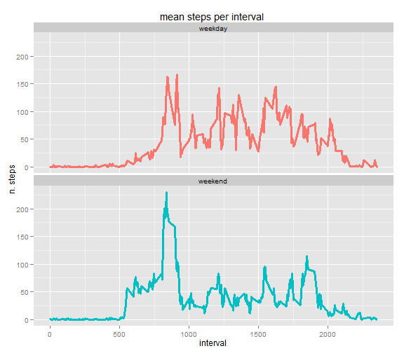

# Reproducible Research: Peer Assessment 1


## Loading and preprocessing the data

The data for this assignment has be downloaded from the course web
site: [Activity monitoring data](https://d396qusza40orc.cloudfront.net/repdata%2Fdata%2Factivity.zip) [52K], unzipped in **/data** directory. 

The variables included in this dataset are:

* steps: Number of steps taking in a 5-minute interval (missing 
    values are coded as `NA`);

* date: The date on which the measurement was taken in YYYY-MM-DD
    format and **parsed in Date format**;

* interval: Identifier for the 5-minute interval in which
    measurement was taken


```r
AMD <- read.table("~/GitHub/RepData_PeerAssessment1/data/activity.csv",
                      header = TRUE,
                      sep = ",",
                      dec = ".",
                      stringsAsFactors = FALSE)


str(AMD)                   # 17586 obs. in three var

dimAMD<- dim(AMD)[1]
## Parse time data
AMD$date <- as.Date(AMD$date, "%Y-%m-%d")

ndays<-length(unique(AMD$date )) #61 days 
nintervals<-length(unique(AMD$interval )) #288 interval in a days 


maxday<-max(AMD$date)
minday<-min(AMD$date)  #Time difference of 60 days
```


The dataset is stored in a comma-separated-value (CSV) file.    This dataset has a total of **17568** observations. 

The dataset comprises **61** days, from 2012-10-01 to 2012-11-30.   
Every day is divided in **288** intervals of 5 minutes.


## What is mean total number of steps taken per day?

For this part of the assignment, I have ignored the missing values in
the dataset.


```r
library (plyr)

# calculate the total number of steps taken per day

AMDday<-ddply(AMD, .(date), summarise,
             d_na=mean(is.na(steps)),
             dtot= sum(steps, na.rm = T),
             dmean=mean(steps, na.rm = T))

str(AMDday)

NAdays<-sum(AMDday$d_na==1) # 8 days with NA
namesNAdays<- unique (AMD$date[is.na(AMD$steps)] )

summary(AMDday$dmean)

meanstepsbyday <- round (mean (AMDday$dtot),1) # 9354
mediantepsbyday <- median (AMDday$dtot) # 10395
```

There are 8 days with NA values in Variable *steps*. Those days that will be at zero in the plot. 

The plot reports the total number of steps taken per day.


```r
library (ggplot2)

ggplot(data=AMDday, aes(x=date, y= dtot, fill= "#FF0000")) + 
    geom_bar(stat="identity",show_guide = F ) +
    ggtitle("total steps by day") + 
    xlab("Date") + ylab( "n. steps")
```

 

For those data: 

* the mean is **9354.2** and

* the median is **10395** 


## What is the average daily activity pattern?

Please find a time series plot of the 5-minute interval (x-axis) and the average number of steps taken, averaged across all days (y-axis).


```r
AMDint<-ddply(AMD, .(interval), summarise,
            i_na=mean(is.na(steps)),
            itot= sum(steps, na.rm = T),
            imean=mean(steps, na.rm = T))

AMDmaxint<- AMDint$interval[AMDint$imean==max(AMDint$imean)]
AMDmax<- round(max(AMDint$imean),0)


ggplot(data=AMDint, aes(x=interval, y= imean)) +
    geom_line(size=1.3,color= "#FF00CC") +
    ggtitle("mean steps per interval ") + 
    xlab("interval") + ylab( "n. steps")
```

 


The minute interval, on average across all the days in the dataset, that contains the maximum number of steps is **835** with a value of **206** steps

## Imputing missing values


```r
sum(is.na(AMD$steps)) # 2304

nNAobs<-sum(!complete.cases(AMD$steps)) # 2304

288*8
NAdays<- length (unique (AMD$date[is.na(AMD$steps)] ) )
namesNAdays<- unique (AMD$date[is.na(AMD$steps)] ) # in 8 days
```


As said before there are 8 days with NA values in Variable *steps*. Those days are 2012-10-01, 2012-10-08, 2012-11-01, 2012-11-04, 2012-11-09, 2012-11-10, 2012-11-14, 2012-11-30.

The total number of rows with `NA`s are **2304** .


The strategy for filling in all of the missing values in a **new**  dataset has been to use the mean for that 5-minute interval.


```r
# fill the days with NA values with 288 mean values mean for that 5-minute interval

AMDf <- AMD
for (i in namesNAdays) {
            
        AMDf$steps[AMD$date==i]<-AMDint$imean
 }

## some error proof

sum(is.na(AMDf$steps)) # 0

sum(!complete.cases(AMDf$steps)) # 0
```

Please find the histogram of the total number of steps taken each day. 

The days filled with the mean for that 5-minute interval have a diferent colour.


```r
AMDfday<-ddply(AMDf, .(date), summarise,
              d_na=mean(is.na(steps)),
              dtot= sum(steps, na.rm = F),
              dmean=mean(steps, na.rm = F))

AMDfday$d_na[AMDfday$date%in%namesNAdays]<-1


fmeanstepsbyday <- mean (AMDfday$dtot) 
fmediantepsbyday <- median (AMDfday$dtot) 

ggplot(data=AMDfday, aes(x=date, y= dtot, fill= factor(d_na))) + 
    geom_bar(stat="identity", show_guide = F ) +
    ggtitle("total steps by day (no NA)") + 
    xlab("Date") + ylab( "n. steps")
```

 

For those data: 

* the mean is 1.0766 &times; 10<sup>4</sup> and

* the median is 1.0766 &times; 10<sup>4</sup> 


## Are there differences in activity patterns between weekdays and weekends?

Please find a panel plot containing a time series plot  of the 5-minute interval (x-axis) and the average number of steps taken, averaged across all weekday days or weekend days (y-axis).


```r
# first I set working days and weekend days
daysinweek<-weekdays(unique(AMD$date)[1:7])
wdays<- daysinweek[1:5]
edays<- daysinweek[6:7]

# then I created a new dataset with an addition variable that account for 
# working days = and not = 0

whatday<- 0

AMDfwe<- cbind (AMDf, whatday)

isworking <- weekdays(AMDfwe$date)%in%wdays

AMDfwe$whatday[isworking]<- 1

# Calculate the average number of steps taken, averaged across all weekday days 
#  or weekend days 

AMDfw <- subset(AMDfwe, whatday ==  1 )
AMDfe <- subset(AMDfwe, whatday ==  0 )


AMDfwint<-ddply(AMDfw, .(interval), summarise,
             flag=1,
            imean=mean(steps, na.rm = T))

AMDfeint<-ddply(AMDfe, .(interval), summarise,
                flag=0,
                imean=mean(steps, na.rm = T))


# append the two files and give names at the two levels

AMDfweint<-rbind(AMDfeint, AMDfwint)

AMDfweint$flag <- as.factor (AMDfweint$flag)

levels(AMDfweint$flag) <- c("weekday" ,"weekend" )

ggplot(data=AMDfweint, aes(x=interval, y= imean, color=flag)) +
    geom_line(size=1.3, show_guide = F  ) +
    facet_wrap(~ flag , ncol=1) +
    ggtitle("mean steps per interval ") + 
    xlab("interval") + ylab( "n. steps")
```

 

